# Информатика 

Лектор: Балакшин Павел Валерьевич.

# Зачетка
Точка | min | max | Ключ |
| :---: | :---: | :---: | :---: |
Дополнительные баллы | 0 | 3 | - 
Лабораторная работа (часть 1) | 5 | 7 | + |
Лабораторная работа (часть 1) | 13 | 21 | + |
Лабораторная работа (часть 1) | 5 | 7 | - |
Домашнее задание | 18 | 25 | - |
Электронное тестирование 1 | 6 | 10 | +
Электронное тестирование 2 | 6 | 10 | +
Экзамен | 7 | 20 | -

# Вес баллов по каждой точке
Точка | min | max |
| :---: | :---: | :---: |
Лабораторная работа №1 | 1 | 3 |
Лабораторная работа №2 | 2 | 4 |
Лабораторная работа №3 | 3 | 6 |
Лабораторная работа №4 | 4 | 9 |
Лабораторная работа №5 | 4 | 6 |
Лабораторная работа №6 | 5 | 7 |
Электронное тестирование 1 | 6 | 10 |
Электронное тестирование 2 | 6 | 10 |
Гугл форма | 0 | 1 |
Аннотация №1 - №7 | 0 | 14 |
Посещение | 0 | 10 |
Экзамен | 7 | 20 |
Итог | 60 | 100 |

# Конвертер в зачетку (Барс):

```mermaid
graph TD;
    Лабораторная_работа_1-->Лабораторная_работа_часть_1;
    Лабораторная_работа_2-->Лабораторная_работа_часть_1;
    Лабораторная_работа_3-->Лабораторная_работа_часть_1;
    Лабораторная_работа_4-->Лабораторная_работа_часть_2;
    Лабораторная_работа_5-->Лабораторная_работа_часть_2;
    Лабораторная_работа_6-->Лабораторная_работа_часть_3;
    Google-forms-->Домашнее_задание;
    Аннотации-->Домашнее_задание;
    Посещение-->Домашнее_задание;
    Лабораторная_работа_часть_1-->Балльно-рейтинговая_система;
    Лабораторная_работа_часть_2-->Балльно-рейтинговая_система;
    Лабораторная_работа_часть_3-->Балльно-рейтинговая_система;
    Домашнее_задание-->Балльно-рейтинговая_система;
    Дополнительные_баллы-->Балльно-рейтинговая_система;
    Электронное_тестирование_1-->Балльно-рейтинговая_система;
    Электронное_тестирование_2-->Балльно-рейтинговая_система;
    Экзамен-->Балльно-рейтинговая_система;
```

