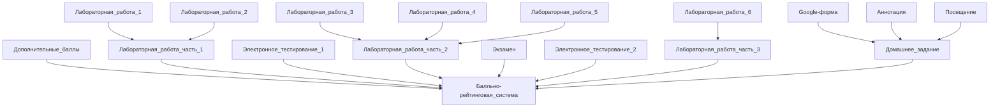

# Информатика 2023-2024 г.г. 
### Лектор: Балакшин Павел Валерьевич
### Отзыв: Так, а смысл писать если у перваков выбора не будет.
### Полезная информация: https://t.me/balakshin_students
-------------------------

## Про разбалловку и автоматы
### Зачетка
Точка | min | max | Ключ |
| :---: | :---: | :---: | :---: |
Дополнительные баллы | 0 | 3 |  
Лабораторная работа (часть 1) | 5 | 7 | + |
Лабораторная работа (часть 2) | 13 | 21 | + |
Лабораторная работа (часть 3) | 5 | 7 |  |
Домашнее задание | 18 | 25 |
Электронное тестирование 1 | 6 | 10 | +
Электронное тестирование 2 | 6 | 10 | +
Экзамен | 7 | 20 |

### Вес баллов по каждой точке
Точка | min | max | Ключ |
| :---: | :---: | :---: | :---: |
Лабораторная работа №1 | 1 | 3 | + |
Лабораторная работа №2 | 2 | 4 | + |
Лабораторная работа №3 | 3 | 6 | + |
Лабораторная работа №4 | 4 | 9 | + |
Лабораторная работа №5 | 4 | 6 | + |
Лабораторная работа №6 | 5 | 7 |
Электронное тестирование 1 | 6 | 10 | + |
Электронное тестирование 2 | 6 | 10 | + |
Google-форма | 0 | 1 |
Аннотация №1 - №7 | 0 | 14 |
Посещение | 0 | 10 |
Экзамен | 7 | 20 |
* Лабраторная работа N - смотреть таблицу `Вес баллов по каждой точке`. При защите лабораторных работ вам выставляют % защиты, после этого переводиться в баллы по формуле: `C = max/100 * % защиты` и `C >= min`.
* Google-форма - 1 балл + 1.25 баллов за посещение.
* Аннотация - до 2 баллов + 1.25 баллов за посещение. При сдачи аннотации вам ставят % работы, после этого переводиться в баллы по формуле: `C = 2/100 * % работы`.
* Дополнительные баллы - выдает лектор за интересную аннотацию (!), за предложенную идею (*), для повышения баллов (^)    
* Экзамен - до 20 баллов, автомат вычисляется по формуле: `C = все баллы * 0.17` и еще закрыты ЦДО тестирования (минимум по 6 баллов за каждый тест).  

### Конвертер в балльно-рейтинговую систему (БАРС)

